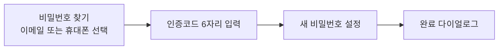

# GamJabi 백엔드 요청사항 — 프론트 연동 후 발견된 갭 17건

작성일 2026-09-21 · Flutter 프론트엔드

## 요약

Flutter 앱을 `https://gamjabi.onrender.com` 에 연동하면서 **프론트에는 구현돼 있지만 백엔드가 받쳐주지 못하는 지점 17건**을 정리했습니다.

OpenAPI 스펙의 응답 스키마가 전부 비어 있어(`"schema": {}`), 아래 모든 항목은 실제 API를 직접 호출해 확인한 것입니다. 추측이 아니라 실측값입니다.

### 현재 연동 상태

| 화면 | 사용 중인 엔드포인트 | 상태 |
| --- | --- | --- |
| 채팅 | `POST /api/v1/chat` | 정상 동작 |
| 등록 | `GET/POST/PATCH/DELETE /members/{id}/watchlist` | 정상 동작 |
| 홈 | 위 + `GET /api/v1/predict` | 동작하나 현재가가 종목당 10~60초 |
| 뉴스 | `GET /market/recap`, `POST /news/summary` | 정상 동작 |
| 로그인·회원가입 (7개 화면) | 없음 | 붙일 API가 없어 미연동 |
| 분석 | `GET /signal`, `/predict`, `/chart` | 정상 동작 (picks 정렬 문제는 아래 참고) |

### 우선순위

| 등급 | 항목 | 한 줄 요약 |
| --- | --- | --- |
| P0 | 1. 인증 전무 | 로그인·회원가입 API가 없고 인가도 없어 누구나 남의 데이터를 수정함 |
| P0 | 2. 인증코드 발송·검증 | 이메일/SMS 6자리 코드 UI만 있고 API 없음 |
| P0 | 3. 비밀번호 재설정 | 3단계 플로우 UI만 있고 API 없음 |
| P0 | 4. 현재가 조회 | 시세 전용 엔드포인트가 없어 평가금액을 제대로 못 그림 |
| P0 | 5. 응답 스키마 부재 | 계약이 깨져도 조용히 앱이 망가짐 |
| P0 | 6. charset 누락 | 한국어 응답이 전부 깨짐. 서버 한 줄로 해결 |
| P1 | 7~11 | 종목 메타데이터, 포트폴리오 집계, 국내주식, 콜드스타트, 시그널 지연 |
| P2 | 12~17 | `/ask` 가드레일, `/chart` 불안정, 프로필 API, 세션 관리, 페이지네이션, `/signal` 미정렬 |

가장 적은 작업으로 효과가 큰 것은 6번과 5번입니다. 6번은 응답 헤더 한 줄, 5번은 라우트마다 Pydantic 모델 한 개씩입니다.

---

## P0-1. 인증이 전혀 없음

**현재 API에는 로그인·회원가입 엔드포인트가 하나도 없고, OpenAPI 스펙에 `securitySchemes` 항목 자체가 없습니다.**

프론트에는 이미 완성된 인증 UI 7개 화면이 있습니다 — 로그인, 회원가입(약관동의 → 정보입력 → 완료), 비밀번호 찾기, 인증코드 확인, 비밀번호 재설정. 붙일 API가 없어 **전부 동작하지 않는 데모 화면으로 남겨둔 상태**입니다.

### 더 심각한 문제: 인가가 없음

현재 사용자 식별은 `discord_id`라는 **자유 문자열 path 파라미터 하나뿐**이고, 워치리스트 POST 시 회원이 자동 생성됩니다. 즉 **누구든 타인의 ID를 알거나 추측하면 그 사람의 포트폴리오를 읽고 수정하고 삭제할 수 있습니다.**

아래는 인증 없이 누구나 바로 실행됩니다:

```
curl -X DELETE https://gamjabi.onrender.com/api/v1/members/<남의ID>/watchlist
```

### 현재 프론트 우회책

`gamjabi-demo-user`라는 고정 문자열을 상수로 박아 쓰고 있습니다. **모든 사용자가 같은 포트폴리오를 공유합니다.**

### 요청

| 메서드 | 경로 | 설명 |
| --- | --- | --- |
| POST | `/api/v1/auth/signup` | 이메일·비밀번호·이름·전화번호 → 사용자 생성 + 토큰 |
| POST | `/api/v1/auth/login` | 이메일·비밀번호 → 토큰 |
| POST | `/api/v1/auth/refresh` | 토큰 갱신 |
| GET | `/api/v1/auth/me` | 토큰 → 현재 사용자 |

그리고 **워치리스트 경로가 path 파라미터가 아니라 토큰으로 식별되게** 바뀌어야 합니다:

- 현재: `GET /api/v1/members/{discord_id}/watchlist`
- 요청: `GET /api/v1/me/watchlist` + `Authorization: Bearer <token>`

방식은 JWT든 세션이든 상관없습니다. 토큰을 헤더로 받아 서버가 소유자를 판단하기만 하면 됩니다.

> 디스코드 봇이 기존 사용처라면 `discord_id` 경로를 없애지 말고 남겨두셔도 됩니다. 다만 앱용 경로는 토큰 기반으로 분리되어야 합니다.

---

## P0-2. 이메일/SMS 인증코드 API 없음

회원가입 화면(`signup_info_screen.dart`)은 이메일과 휴대폰 각각에 대해 6자리 인증코드 입력과 180초 타이머를 갖추고 있습니다. 비밀번호 찾기 플로우에도 같은 화면이 하나 더 있습니다.

**현재는 아무 6자리나 입력하면 통과합니다.** 검증할 서버가 없어서 클라이언트에서 자릿수만 세고 있습니다. 코드 주석에도 데모라고 적혀 있습니다.

### 요청

| 메서드 | 경로 | 요청 | 응답 |
| --- | --- | --- | --- |
| POST | `/api/v1/auth/verify/send` | `{channel: "email"\|"sms", target}` | `{sent: true, expires_in: 180}` |
| POST | `/api/v1/auth/verify/confirm` | `{channel, target, code}` | `{verified: true}` |

프론트가 이미 전제하고 있는 규칙입니다. 다르면 알려주세요.

- 코드 길이 6자리 숫자
- 유효시간 180초
- 이메일 형식 `^[\w.\-]+@[\w\-]+\.[\w.\-]+$`
- 휴대폰 형식 `^01[0-9]{8,9}$`

재전송 쿨다운과 시도 횟수 제한도 서버에서 걸어주시면 좋겠습니다.

---

## P0-3. 비밀번호 재설정 API 없음

프론트에 3단계 플로우가 이미 구현돼 있습니다.



세 화면 모두 UI만 있고 서버 호출은 없습니다. 마지막 단계는 성공 다이얼로그만 띄우고 끝납니다.

### 요청

| 메서드 | 경로 | 설명 |
| --- | --- | --- |
| POST | `/api/v1/auth/password/forgot` | 이메일 또는 휴대폰으로 재설정 코드 발송 |
| POST | `/api/v1/auth/password/reset` | 코드 + 새 비밀번호 → 변경 |

프론트가 검사하는 비밀번호 정책은 **8자 이상 + 특수문자 1개 이상**입니다. 서버도 같은 규칙을 강제해주세요. 클라이언트 검사만 있으면 우회됩니다.

2번 항목의 인증코드 API와 같은 메커니즘을 써도 됩니다. 따로 만드실 필요는 없습니다.

---

## P0-4. 현재가 조회 엔드포인트가 없음

**현재가를 돌려주는 엔드포인트가 `/api/v1/predict` 하나뿐인데, 이것이 LLM 기반이라 종목당 10~60초 걸립니다.**

홈 화면은 보유 종목의 평가금액과 수익률을 보여줘야 하는데, 그러려면 종목마다 `/predict`를 한 번씩 불러야 합니다. 즉 **10종목 포트폴리오면 수분이 걸립니다.**

### 현재 프론트 우회책

- 총 매입금액(수량 × 평단가)은 로컬 계산으로 즉시 표시
- 현재가는 백그라운드에서 동시 2개 제한으로 호출해 도착하는 대로 채움
- 결과는 10분 TTL 캐시
- 로딩 중인 종목은 스켈레톤 표시

이렇게까지 해도 근본 해결은 아닙니다. 사용자는 앞으로도 수십 초를 기다려야 합니다.

### 요청

시세만 돌려주는 **가벼운 벌크 엔드포인트** 하나가 필요합니다. LLM을 타지 않고 yfinance 값을 그대로 내려주면 됩니다.

```
GET /api/v1/quotes?tickers=NVDA,AAPL,MSFT
```

```json
{
  "as_of": "2026-09-21",
  "quotes": [
    {"ticker": "NVDA", "price": 219.34, "change_pct": 1.52, "prev_close": 216.06}
  ]
}
```

응답 시간 **1초 미만**, 한 번에 최소 20개 티커 처리가 목표입니다.

이 엔드포인트 하나가 생기면 홈 화면이 **수분 → 1초**로 바뀝니다. 이번 목록에서 사용자 체감이 가장 크게 달라지는 항목입니다.

> `/predict`는 지금처럼 상세 분석용으로 남겨두시면 됩니다. 분리만 해주세요.

---

## P0-5. OpenAPI 응답 스키마가 전부 비어 있음

모든 라우트가 평범한 dict를 반환해서 `openapi.json`의 응답 스키마가 전부 비어 있습니다.

```json
"responses": {
  "200": {
    "description": "Successful Response",
    "content": {"application/json": {"schema": {}}}
  }
}
```

### 이게 왜 문제인가

프론트 Dart 모델을 쓰려면 응답 형태를 알아야 하는데, 스펙에 없으니 **엔드포인트를 하나씩 실제로 호출해서 응답을 추론**해야 했습니다. `/market/recap`처럼 15초씩 걸리는 것도 있어서 시간이 상당히 들었습니다.

더 큰 문제는 앞으로입니다. **백엔드가 필드 이름을 바꾸거나 타입을 바꿔도 아무도 모릅니다.** 앞으로 프론트에서 값이 조용히 `null`로 떨어지거나 화면이 비어서야 알게 됩니다.

### 요청

각 라우트에 Pydantic `response_model`을 붙여주세요.

```python
class QuoteOut(BaseModel):
    ticker: str
    price: float
    change_pct: float

@router.get("/quotes", response_model=list[QuoteOut])
def quotes(tickers: str): ...
```

라우트당 모델 하나씩이면 됩니다. 이게 생기면 프론트가 스펙만 보고 모델을 쓸 수 있고, 계약이 깨지면 바로 드러납니다.

우선순위를 놓자면 프론트가 실제로 쓰는 6개부터면 충분합니다 — `/chat`, `/members/{id}/watchlist` (GET/POST/PATCH), `/market/recap`, `/news/summary`, `/predict`.

---

## P0-6. charset 누락으로 한국어가 깨짐

응답 헤더가 `Content-Type: application/json` 인데 **charset이 없습니다.**

HTTP 클라이언트는 charset이 없으면 RFC 2616에 따라 **latin-1로 폴백**합니다. 이 API는 `reply`, `headline`, `say`, `llm_reasoning` 등 응답이 전부 한국어라 **모든 텍스트가 깨집니다.**

Dart `package:http` 기준으로 `response.body`를 그대로 쓰면 모자바케가 나오고, 이건 프론트만의 문제가 아니라 **표준을 따르는 모든 클라이언트에서 동일하게 발생**합니다.

### 요청 1 — 응답 헤더

```
Content-Type: application/json; charset=utf-8
```

FastAPI에서는 `JSONResponse`의 `media_type` 지정이나 미들웨어 한 줄이면 됩니다. **이번 목록에서 가장 고치기 쉬운 항목입니다.**

### 요청 2 — 한국어 요청 바디 400

한국어가 들어간 요청 바디를 보냈을 때 아래가 나왔습니다.

```json
{"detail": "There was an error parsing the body"}
```

같은 바디를 UTF-8 바이트로 인코딩해 보내면 200이 나옵니다. 프론트는 `utf8.encode(jsonEncode(body))`로 우회했지만, 서버가 요청 바디를 UTF-8로 관대하게 받아주시면 좋겠습니다.

둘 다 프론트에서 막아둔 상태라 지금 앱 화면은 멀쩡합니다. 다만 다른 클라이언트(웹, 디스코드 봇, Postman)는 그대로 깨집니다.

---

## P1-7. 워치리스트에 종목 메타데이터 필드 없음

`WatchlistAddRequest`가 받는 건 `ticker`, `username`, `quantity`, `avg_buy_price` 네 개이고, 그중 `username`은 회원 표시이름이라 종목 관련 정보는 실질 3개뿐입니다.

그런데 등록 화면은 원래 7개를 받고 있었습니다 — 종목명, 종목코드, 수량, 평단가, 자산구분(국내주식/미국주식/ETF), 관리기준(추천종목/장기보유/관심관찰), 메모.

**저장할 곳이 없어서 네 개 입력을 폼에서 제거했습니다.** 입력한 것과 저장되는 것이 다르면 사용자가 혼란스러우니까요.

### 요청

아래 필드를 워치리스트 항목에 추가해주세요. 전부 선택값이면 됩니다.

| 필드 | 타입 | 용도 |
| --- | --- | --- |
| `name` | string | 종목명 (예: NVIDIA) |
| `memo` | string | 진입 근거·리스크 메모 |
| `strategy` | string | 관리 기준 |
| `asset_type` | string | 자산 구분 |

`POST`와 `PATCH` 및 `GET` 응답에 같이 실리면 프론트에서 원래 디자인을 복원하겠습니다.

> 종목명은 티커만 있으면 서버에서 채워줄 수도 있을 듯합니다. yfinance에 이미 있는 값이니까요. 그러면 사용자가 직접 입력할 필요가 없습니다.

---

## P1-8. 포트폴리오 집계 엔드포인트 없음

지금은 프론트가 직접 계산합니다.

- 총 매입금액 = 종목별 (수량 × 평단가) 합산 — 로컬에서 가능
- 총 평가금액 = 종목별 (수량 × 현재가) 합산 — **종목마다 `/predict` 호출이 끝나야 계산 가능**

그래서 평가금액은 모든 종목의 시세가 도착한 뒤에야 표시됩니다. 일부만 도착한 상태에서 합산하면 그건 그냥 틀린 숫자라서, 현재는 그전까지 매입금액만 보여주고 있습니다.

### 요청

4번의 시세 엔드포인트가 생기면 프론트에서 해결되는 문제라 **필수는 아닙니다.** 다만 서버에서 한 번에 내려주면 더 깔끔합니다.

```
GET /api/v1/members/{id}/portfolio
```

```json
{
  "total_cost": 877.36,
  "total_value": 912.40,
  "return_pct": 3.99,
  "as_of": "2026-09-21",
  "holdings": [
    {"ticker": "NVDA", "quantity": 4.0, "avg_buy_price": 219.34,
     "current_price": 228.10, "value": 912.40, "return_pct": 3.99}
  ]
}
```

이렇게 되면 홈 화면은 요청 한 번으로 끝나고, 수익률 계산 로직이 프론트와 백엔드에 중복으로 존재하지 않게 됩니다.

우선순위는 4번 다음입니다. 4번만 해결되면 이건 안 하셔도 무방합니다.

---

## P1-9. 국내 주식 미지원

API 설명에 적힌 대로 이 서비스는 **미국 우량주 약 10종목 전용**입니다. 가격은 USD이고 식별자는 티커입니다.

반면 프론트는 삼성전자·SK하이닉스·NAVER 목업과 원화 표기를 전제로 만들어져 있었고, 등록 화면의 자산구분 기본값도 국내주식이었습니다. 즉 **기본값이 API가 유일하게 처리할 수 없는 값**이었습니다.

현재는 상의대로 **앱 전체를 미국 주식·USD로 전환**했습니다. 목업 종목을 지우고, 통화 포맷을 `$`로 바꾸고, 채팅 추천 질문도 교체했습니다.

### 확인 부탁

이건 요청이라기보다 **방향을 확정해달라는 질문**입니다.

1. 미국 주식 전용으로 계속 갈 계획이면 → 지금 상태 그대로 두면 됩니다.
2. 국내 주식을 나중에 넣을 계획이면 → KRX 티커 처리와 통화 필드(`currency`)가 응답에 필요합니다. 프론트는 통화별 포맷을 미리 준비해두겠습니다.

또 하나 — **지원 종목 목록을 엔드포인트로 내려주시면** 등록 화면에서 자동완성을 제공하고, 범위 밖 티커를 입력 단계에서 막을 수 있습니다.

```
GET /api/v1/tickers
```

지금은 범위 밖 티커를 등록해도 등록은 되고 `/predict`만 조용히 빈 값을 돌려줘서, 사용자 입장에선 이유 없이 수익률이 안 나오는 것처럼 보입니다.

---

## P1-10. Render 무료 티어 콜드 스타트

일정 시간 유휴하면 dyno가 잠들어서 **첫 요청이 503으로 떨어지거나 30~60초 걸립니다.** 워밍 후엔 `/health`가 0.5초입니다.

```
HTTP/1.1 503 Service Unavailable
Retry-After: 5
```

### 현재 프론트 우회책

- 502/503/504에서 `Retry-After`를 존중해 최대 3회 재시도
- 앱 시작 시 `/health`를 fire-and-forget으로 호출해 미리 깨움
- 대기 중엔 사용자에게 서버를 깨우는 중이라는 배너 표시

대부분은 이걸로 덮힙니다. 다만 **완전히 식은 상태에서의 `/market/recap`은 150초 상한도 넘길 수 있습니다.** 원래 15초짜리 요청이니까요.

### 요청

데모나 발표를 앞두고 있다면 둘 중 하나를 제안드립니다.

1. 유료 티어로 전환 — 가장 확실합니다.
2. 외부 cron으로 10분마다 `/api/v1/health`를 치기 — 무료로 가능하고 효과도 큽니다.

데모 직전에 한 번 깨워두는 것만으로도 충분합니다. **이건 서버 코드 변경 없이 운영으로 해결되는 항목입니다.**

---

## P1-11. `/signal` 데이터가 17일 지연

2026-09-21 기준으로 확인한 값입니다.

| 엔드포인트 | `as_of` | 오늘 기준 지연 |
| --- | --- | --- |
| `/api/v1/signal` | 2026-09-04 | **17일** |
| `/api/v1/predict` | 2026-09-18 | 3일 |
| `/api/v1/market/recap` | 2026-09-18 | 3일 |
| `/api/v1/news/summary` | 2026-09-18 | 3일 |

`/signal`은 설명에 적힌 대로 로컬에서 미리 계산된 CSV를 읽습니다. 그 CSV가 9월 4일 이후로 갱신되지 않은 것으로 보입니다.

### 요청

CSV 갱신 잡업을 정기적으로 돌려주세요. 매일 장 마감 후가 적절해 보입니다.

만약 수동 갱신이 불가피하다면, 응답의 `as_of`를 프론트가 항상 노출하도록 하겠습니다. 오래된 데이터를 오늘자 추천인 것처럼 보여주는 것만은 피해야 하니까요.

> 참고로 분석 탭은 이번 연동 범위에서 제외했습니다. `/signal`을 쓰는 화면은 아직 없으니 급하진 않습니다.

---

## P2-12. `/ask` 가드레일이 정상적인 질문을 거름

`/api/v1/ask`는 1단계에서 주식 관련 질문인지 분류하는데, **명백한 주식 질문도 거릅니다.**

실제 호출 결과입니다.

```
GET /api/v1/ask?q=엔비디아 요즘 어때?
```

```json
{"ok": true, "is_stock_related": false,
 "reason": "질문이 주식이나 금융시장과 관련이 없음"}
```

엔비디아 전망을 묻는 질문을 주식과 무관하다고 판단했습니다.

반면 **같은 질문을 `/chat`에 보내면 출처까지 붙여서 잘 답합니다.** 그래서 채팅 화면은 `/ask`가 아니라 `/chat`을 쓰도록 붙였습니다.

### 요청

프론트가 `/ask`를 안 쓰고 있으니 **급하지는 않습니다.** 다만 디스코드 봇에서도 같은 가드레일을 쓰고 있다면 거기서도 똑같이 멀쩡한 거절이 나고 있을 겁니다.

분류기 프롬프트에 종목명(한글 표기 포함)이 들어가면 주식 질문으로 본다는 규칙을 추가하거나, 아예 `/chat`으로 통일하는 것도 방법입니다.

---

## P2-13. `/chart` 간헐적 404

같은 티커로 몇 분 간격을 두고 호출했는데 결과가 달랐습니다.

| 시각 | 요청 | 결과 |
| --- | --- | --- |
| 1차 | `GET /chart?ticker=NVDA&period=6mo` | `404`, 헤더 `x-error: no OHLCV for NVDA` |
| 2차 | `GET /chart?ticker=NVDA&period=1y` | `200`, `image/png` 151KB |

흥미로운 건 **같은 시간대에 `/predict?ticker=NVDA`는 OHLCV를 정상으로 가져와서 이동평균선까지 계산했다는 점**입니다. 즉 데이터가 없어서가 아니라 차트 경로의 fetch가 간헐적으로 실패하는 것으로 보입니다.

yfinance 호출이 레이트 리밋에 걸리거나 타임아웃이 나는데 404로 응답하는 것 아닐까 싶습니다.

### 요청

1. 데이터 없음(404)과 일시적 조회 실패(503 또는 502)를 구분해주세요. 프론트가 재시도 여부를 판단할 수 있습니다.
2. `/predict`가 이미 받아온 OHLCV를 재사용할 수 있다면 차트도 같은 경로를 타면 좋겠습니다.

분석 탭은 이번 범위 밖이라 **지금 막히지는 않습니다.** 다만 차트를 붙일 때는 이 불안정성이 그대로 드러납니다.

> 참고: 응답에 `Cache-Control: public, max-age=300`이 있어서 프론트는 별도 캐시 없이 `Image.network`만 써도 됩니다. 이 부분은 잘 돼 있습니다.

---

## P2-14. 회원 프로필 조회/수정 API 없음

`WatchlistAddRequest`에 `username` 필드가 있어서 회원 표시이름을 **쓸 수는 있는데, 읽거나 바꿀 방법이 없습니다.**

그러니까 종목을 등록할 때마다 이름을 끝없이 같이 보내야 하고, 정작 마이페이지를 만들려면 그 값을 다시 읽을 수가 없습니다.

현재 프론트는 인증이 없어 프로필 화면 자체를 만들지 않았기 때문에 `username`을 아예 안 보내고 있습니다.

### 요청

1번(인증)이 해결되면 자연스럽게 같이 해결될 항목입니다.

| 메서드 | 경로 | 설명 |
| --- | --- | --- |
| GET | `/api/v1/me` | 이름·이메일·가입일 |
| PATCH | `/api/v1/me` | 표시이름 등 수정 |

그리고 `username`은 워치리스트 요청 바디에서 **빼주셔도 됩니다.** 종목을 등록하는 요청에 회원 이름이 들어있는 건 역할이 섞여 있는 것이라, 처음 보는 사람은 종목명으로 오해하기 쉽습니다. 저도 처음에 그렇게 읽었습니다.

---

## P2-15. 채팅 세션 관리 부재

`POST /api/v1/chat`은 `session_id`로 대화 메모리를 나눠 잘 동작합니다. 다만 세션을 **목록으로 보거나, 내용을 다시 읽거나, 명시적으로 지우는 방법이 없습니다.**

### 지금 동작

채팅 화면의 새로고침 버튼은 `session_id`를 새로 발급해서 대화를 초기화합니다. 이전 세션은 그냥 버려집니다.

처음엔 로컬 리스트만 비웠는데, 그러면 서버는 여전히 이전 대화를 기억하고 있어서 봇이 지워진 내용을 계속 참조했습니다. 그래서 세션 재발급으로 바꾸었습니다.

### 영향

- **버려진 세션이 서버에 계속 쌓입니다.** 사용자가 새로고침을 누를 때마다 고아 세션이 하나씩 생깁니다. 메모리나 저장소가 신경 쓰이면 TTL을 두셔야 합니다.
- 앱을 재시작하면 대화가 사라집니다. 대화 내역 기능을 만들려면 서버 지원이 필요합니다.

### 요청

우선순위는 낮습니다. 대화 내역 기능을 정식으로 할 계획이 생기면 그때 같이 논의하면 됩니다.

| 메서드 | 경로 | 설명 |
| --- | --- | --- |
| GET | `/api/v1/chat/sessions` | 내 세션 목록 |
| GET | `/api/v1/chat/sessions/{id}` | 대화 내역 |
| DELETE | `/api/v1/chat/sessions/{id}` | 세션 삭제 |

당장은 **유휴 세션 TTL만 걸어주셔도 충분**합니다.

---

## P2-16. 워치리스트 개수 제한·페이지네이션 없음

`GET /members/{id}/watchlist`는 전체를 한 번에 내려주고 `limit`이나 `offset`이 없습니다. 등록 개수 상한도 없습니다.

포트폴리오는 보통 수십 개 규모라 **지금 구조로 문제가 생기진 않습니다.** 다만 두 가지는 같이 봐주시면 좋겠습니다.

1. **등록 상한** — 인증이 없는 지금은 스크립트로 한 계정에 수만 개를 넣을 수 있습니다. 계정당 100개 정도면 충분해 보입니다.
2. **티커 유효성 검사** — 지금은 `ZZZZZZZ` 같은 존재하지 않는 티커도 그대로 저장됩니다. 등록 시점에 거르면 사용자가 바로 알 수 있습니다.

2번은 9번에서 언급한 `GET /api/v1/tickers`가 생기면 프론트에서도 막을 수 있습니다. 다만 서버에서도 한 번 더 검사하는 게 맞습니다.

이번 16개 중 **제일 낮은 우선순위**입니다. 알고만 계시면 됩니다.

---

## 부록 — 프론트가 쓰는 엔드포인트와 실측치

2026-09-21 기준, 서버가 워밍된 상태에서 직접 호출한 값입니다.

| 엔드포인트 | 사용 화면 | 응답 시간 | 비고 |
| --- | --- | --- | --- |
| `GET /health` | 앱 시작 워밍 | 0.5초 | 콜드 시 3.8초 |
| `POST /chat` | 채팅 | 1.3초 | 응답 `{reply}` 단일 키 |
| `GET /members/{id}/watchlist` | 등록·홈 | 0.6초 | |
| `POST /members/{id}/watchlist` | 등록 | 0.8초 | 중복 시 `already:true` |
| `POST /news/summary` | 뉴스 | 4초 | |
| `GET /market/recap` | 뉴스 | 15초 | 가장 느린 정상 경로 |
| `GET /predict` | 홈 (현재가) | 10~60초 | 4번 항목의 원인 |

### 워치리스트 항목 실제 응답

이 형태에 맞춰 Dart 모델을 고정해둔 상태입니다. **키 이름이나 타입이 바뀌면 알려주세요.**

```json
{
  "discord_id": "gamjabi-demo-user",
  "count": 1,
  "items": [{
    "ticker": "NVDA",
    "quantity": 4.0,
    "avg_buy_price": 219.34,
    "added_at": "2026-09-21 11:26:51",
    "updated_at": "2026-09-21 11:26:51"
  }]
}
```

날짜 형식이 `2026-09-21 11:26:51`로 공백 구분입니다. ISO-8601(`2026-09-21T11:26:51Z`)이면 타임존이 명확해져서 더 좋습니다. 지금은 현지시각인지 UTC인지 구별할 수 없습니다.

### 프론트가 이미 대응해둔 것

백엔드에서 고치시면 삭제할 예정인 우회 코드입니다.

- 응답을 `utf8.decode(bodyBytes)`로 직접 디코딩 (6번)
- 요청 바디를 `utf8.encode`로 인코딩 (6번)
- 502/503/504 재시도 + 부팅 워밍 핑 (10번)
- `/predict` 동시 2개 제한 + 10분 캐시 (4번)
- 고정 사용자 키 `gamjabi-demo-user` (1번)

### 문의

응답 형태를 바꾸실 때는 미리 한 번만 공유해주세요. 프론트 모델이 직접 영향받습니다.

---

## 추가 발견 — `/signal`의 picks가 정렬돼 있지 않음

분석 탭 작업 중 확인했습니다. `GET /api/v1/signal?top_n=5` 응답의 `picks` 배열이 `final_prob` 순이 아닙니다.

```
PANW 0.5255
MSTR 0.5378   ← 가장 높은데 2번째
DDOG 0.5172
COIN 0.5291
IONQ 0.5130
```

`prob_lgb` 순도, `prob_lstm` 순도 아닙니다. 정렬 기준이 없어 보입니다.

"top-N 매수 시그널"이라는 이름 때문에 클라이언트는 배열 순서를 순위로 받아들이기 쉽습니다. 프론트는 지금 `final_prob` 내림차순으로 다시 정렬해서 표시하고 있습니다.

### 요청

서버에서 `final_prob` 내림차순으로 정렬해 내려주시거나, 정렬 기준이 따로 있다면 알려주세요. 의도한 순서가 있는데 프론트가 임의로 뒤집고 있는 것이면 문제입니다.

우선순위는 P2입니다. 다만 `top_n`으로 개수를 자르는 엔드포인트라면 자르기 전에 정렬이 되어 있어야 맞습니다 — 지금 구조면 `top_n=3`일 때 실제 상위 3개가 아닐 수 있습니다.
